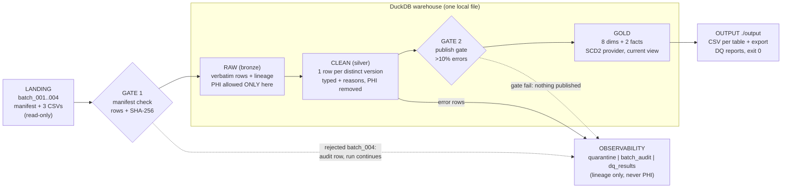

# Northwind Health Encounter Pipeline

A local, containerised data pipeline for the Skypoint Data Engineering
Assessment. It ingests four weekly batches of messy healthcare encounter CSVs
from three EHR source systems, validates every delivery against its manifest,
cleans and de-identifies the data, maintains full version history with
duplicate/stale protection, and publishes a governed warehouse model plus the
required `chronic_acute_encounters.csv` export — with lineage from every
output number back to the batch, file and row it came from.

## Architecture



Everything per batch is **nothing-until-decided**: files are validated, read,
cleaned and version-classified in memory, the publish gate is evaluated, and
only then does a single write transaction land raw, clean, quarantine and
audit together. A rejected or gate-failed batch leaves exactly two traces —
audit rows and DQ results — and changes no modeled table.

## How to run

> **Data pack first:** the assessment data is confidential and this
> repository is public (both per the invitation email), so the pack is not
> committed. Copy the provided `candidate_pack` folder to
> `data/candidate_pack/` — see [data/README.md](data/README.md) for the
> expected layout. Everything else is one command.

```bash
git clone https://github.com/Madhav1301/skypoint-assessment.git
cd skypoint-assessment
# place the provided data pack at data/candidate_pack/
cp .env.example .env          # safe development defaults
docker compose up --build
```

Processes `batch_001` → `batch_004` in order and writes every output to
`./output`. The deliberately corrupted `batch_004` (truncated EPIC file: 18
rows vs 22 declared, SHA mismatch) is **rejected and reported, not fatal** —
the run still exits 0.

### How to run the tests

```bash
docker compose run --rm tests
```

256 tests: unit tests for every parser (inputs lifted from real pack values)
and integration tests for the full pipeline, including the **idempotency
proof** (batch-by-batch == full rebuild, byte-identical outputs) and the
**publish-gate proof** (a >10%-error batch publishes nothing).

Without Docker (local Python 3.12):

```bash
python -m venv .venv
.venv/Scripts/pip install -r requirements.txt    # Windows; use bin/ on Linux
.venv/Scripts/python -m pytest -q
set PYTHONPATH=src && set PATIENT_KEY_SECRET=dev-key && .venv/Scripts/python -m pipeline.run
```

### Where outputs land

| File(s) | Contents |
|---|---|
| `fact_encounter_versions.csv` | every accepted version (insert-only history, arrival batch, lineage) |
| `fact_encounter_current.csv` | latest version per encounter + `version_count` |
| `dim_provider.csv` | SCD2 provider dimension (validity periods) |
| `dim_patient.csv`, `dim_facility.csv`, `dim_diagnosis.csv`, `dim_payer.csv`, `dim_date.csv` | remaining dimensions |
| `chronic_acute_encounters.csv` | the required Task 7 export (247 rows) |
| `quarantine.csv` | every rejected row: reason codes + lineage, no PHI |
| `batch_audit.csv` | per batch and file: received / new / duplicate / stale / quarantined, status, timings |
| `dq_results.csv`, `dq_report_batch_00N.md` | checks by severity and the per-batch DQ report |
| `warehouse.duckdb` | the full warehouse (NOT committed: its raw layer contains PHI) |

## The six required query patterns

Run these against `output/warehouse.duckdb` (e.g. `duckdb output/warehouse.duckdb`
or via Python). They are executed verbatim by
`tests/integration/test_readme_queries.py`, so they cannot rot.

**1. Monthly encounter volume and billed amount by facility and encounter
type — current state, excluding VOID (the headline use case):**

```sql
SELECT f.facility_name, c.encounter_type, c.admit_year, c.admit_month,
       count(*)              AS encounters,
       sum(c.billed_amount)  AS total_billed_usd
FROM gold.fact_encounter_current c
JOIN gold.dim_facility f USING (facility_id)
WHERE c.claim_status IS NOT NULL AND c.claim_status <> 'VOID'
  AND c.admit_date IS NOT NULL
GROUP BY ALL
ORDER BY c.admit_year, c.admit_month, f.facility_name, c.encounter_type;
```

**2. Full version history of one encounter, with the batch each version
arrived in** (this encounter was re-stated in batch_002 and its old version
was replayed in batch_003 — the replay is a duplicate, not a version):

```sql
SELECT source_batch_id AS arrived_in_batch, last_updated_ts_utc,
       claim_status, billed_amount
FROM gold.fact_encounter_versions
WHERE source_system = 'ATHENA_CLINICS' AND source_record_id = '139507'
ORDER BY last_updated_ts_utc;
```

**3. For any export row: its source batch, file and row number** (joined back
to the raw layer to prove the pointer is real):

```sql
SELECT e.encounter_key, e.source_batch_id, e.source_file_name,
       e.source_row_number, r.source_record_id AS raw_record_id
FROM gold.chronic_acute_encounters e
JOIN raw.encounters r
  ON  r.batch_id          = e.source_batch_id
  AND r.file_name         = e.source_file_name
  AND r.source_row_number = e.source_row_number
LIMIT 5;
```

**4. The attending provider's specialty and employment status at the time of
the encounter** (point-in-time SCD2 join; NPI 1228088641 flips Affiliated →
Employed on 2024-07-01):

```sql
SELECT c.source_record_id, c.admit_date,
       p.provider_last_name, p.specialty, p.employment_status
FROM gold.fact_encounter_current c
JOIN gold.dim_provider p
  ON  p.npi = c.attending_npi
  AND c.admit_date >= p.valid_from AND c.admit_date < p.valid_to
WHERE c.attending_npi = '1228088641'
ORDER BY c.admit_date;
```

**5. The same monthly totals as they were known at the end of batch_002**
(as-of reporting — possible because history is insert-only and every version
carries its arrival batch):

```sql
WITH as_of_batch_002 AS (
    SELECT * FROM gold.fact_encounter_versions
    WHERE source_batch_id <= 'batch_002'
    QUALIFY row_number() OVER (
        PARTITION BY source_system, source_record_id
        ORDER BY last_updated_ts_utc DESC) = 1
)
SELECT f.facility_name, a.encounter_type, a.admit_year, a.admit_month,
       count(*) AS encounters, sum(a.billed_amount) AS total_billed_usd
FROM as_of_batch_002 a
JOIN gold.dim_facility f USING (facility_id)
WHERE a.claim_status IS NOT NULL AND a.claim_status <> 'VOID'
GROUP BY ALL
ORDER BY ALL;
```

**6. Everything quarantined or rejected, with reason codes:**

```sql
SELECT batch_id, file_name, source_row_number, errors, field_reasons
FROM meta.quarantine
UNION ALL BY NAME
SELECT batch_id, file_name, NULL AS source_row_number,
       reason AS errors, NULL AS field_reasons
FROM meta.batch_audit
WHERE status IN ('REJECTED', 'GATE_FAILED')
ORDER BY batch_id, file_name NULLS FIRST, source_row_number;
```

## Key assumptions (the calls the brief leaves open)

| # | Decision |
|---|---|
| A1 | batch_004 is rejected in its entirety (all-or-nothing); its two valid files are not loaded. |
| A2 | `Cancelled` → VOID; `Rejected` → DENIED; `Pending`/`In Process` → SUBMITTED. |
| A3 | BadgerCare Plus / IA Medicaid / State Medicaid Plan → MEDICAID; TRICARE and Workers Comp → OTHER. |
| A4 | Equal-timestamp redeliveries are duplicates; the first arrival wins (deterministic by batch, then row order). |
| A5 | Facility resolution is a curated alias table, not fuzzy matching: deterministic and auditable; unknowns quarantine. |
| A6 | A date is invalid-future if after that batch's manifest `delivered_at` (catches the planted 2031 dates). |
| A7 | Two-digit years mean 20xx (per source metadata). |
| A8 | Discharge before admit: row kept + flagged, length of stay null. A *blank* discharge is a valid state (reason recorded, no DQ warning). |
| A9 | Identities without DOB get a per-system patient key and are never linked across systems (brief's minimum rule). |
| A10 | E-prefixed dotless codes (E1165) are read as ICD-10, not ICD-9 E-codes; only purely numeric codes classify as ICD-9. |
| A11 | MEDITECH wall-clock times in the DST fall-back overlap resolve to the second (standard-time) occurrence. |
| A12 | Publish gate threshold 10%: healthy batches show ~1% error rows; 10% separates noise from systemic failure. |
| A13 | Export filters are fail-closed: a null value fails its condition. |
| A14 | A version older than the newest already held (not an exact redelivery) is counted stale and excluded from history, so it can never affect current state or as-of reporting. |
| A15 | `patient_key` is HMAC-SHA256 truncated to 128 bits; person-scope and identity-scope inputs are domain-separated. |
| A16 | The DuckDB file is not committed: its raw layer contains PHI. The committed CSVs are PHI-free by construction. |
| A17 | The invitation email supersedes the brief where they conflict: the repository is **public**, therefore the confidential data pack is excluded from the repository and its entire git history; assessors place their copy at `data/candidate_pack/` before running. |

## System requirements, limitations

- **Docker** (Compose v2) is the only requirement for the standard run.
  Development without Docker needs Python 3.12.
- All configuration via environment variables — see `.env.example`
  (`PATIENT_KEY_SECRET`, `PUBLISH_GATE_THRESHOLD`, `LOG_LEVEL`).
- Known limitations: patient linkage implements exactly the brief's minimum
  rule (false merges of same-name/same-DOB people are possible — see
  ARCHITECTURE.md for the risk discussion); ICD-9 codes are reported, never
  mapped; the semantic-search bonus is not included in the core image by
  design.

## Documentation

- [ARCHITECTURE.md](ARCHITECTURE.md) — data model, production design on
  Databricks/Snowflake, PHI governance, quality at scale, cost.
- [docs/DEVELOPER_GUIDE.md](docs/DEVELOPER_GUIDE.md) — plain-language
  walkthrough of every module, function, config file and table; includes a
  glossary and a "where would I change X?" cheat sheet.
- [AI_USAGE.md](AI_USAGE.md) — where AI tooling helped, where it was wrong,
  where it was overridden.
